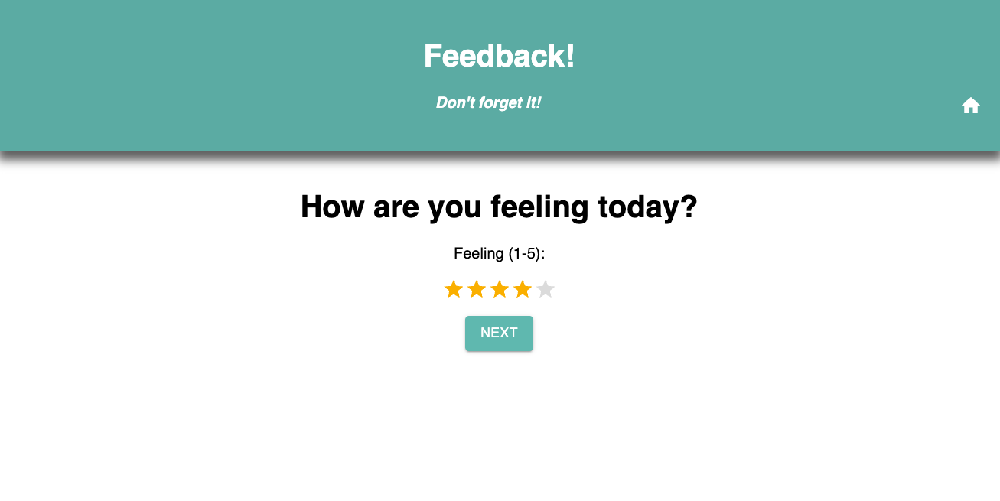
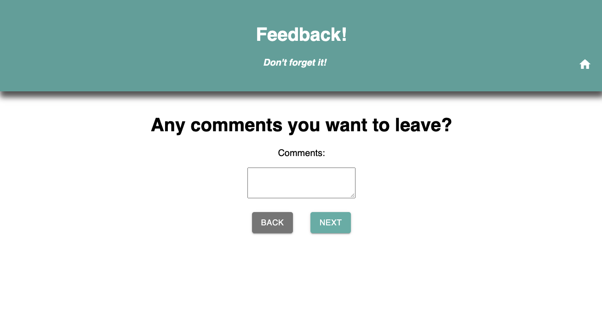
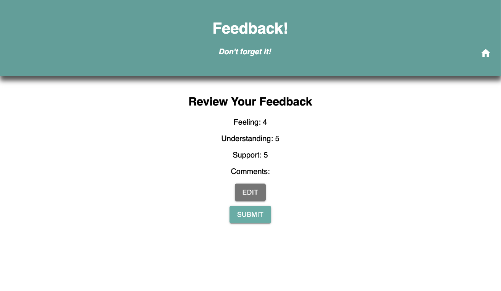
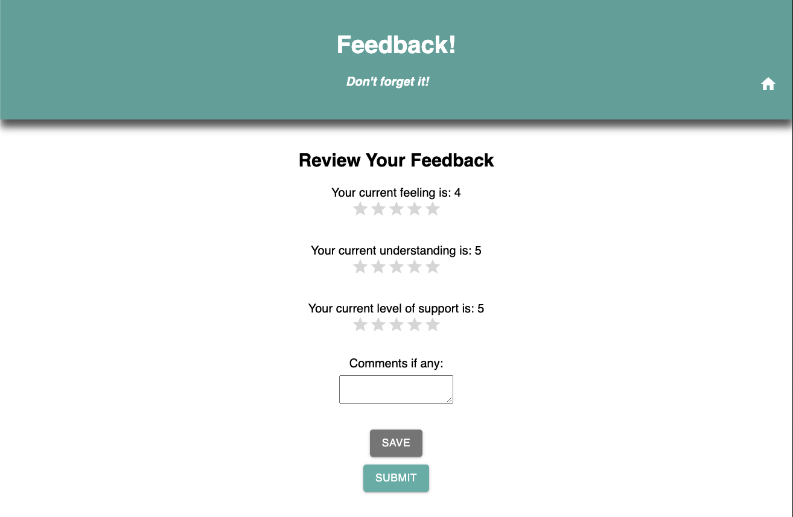
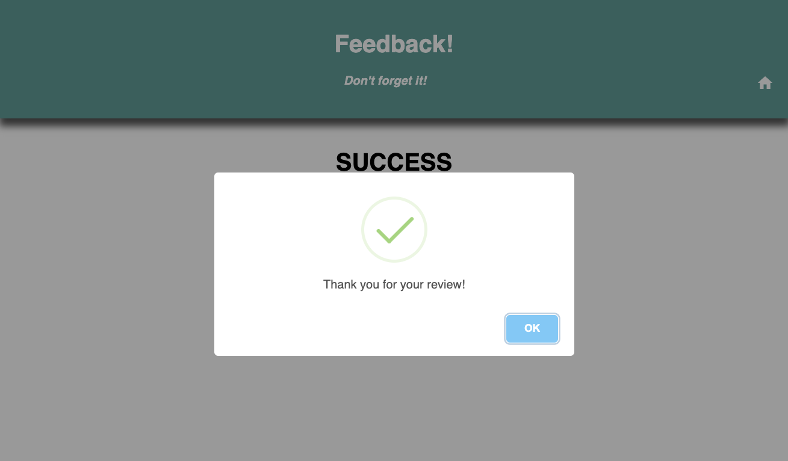
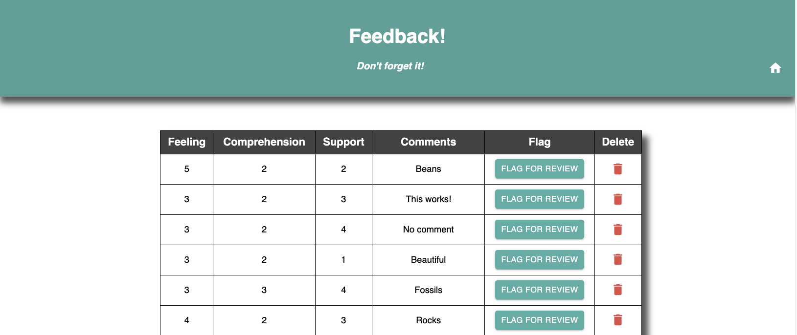

# Weekend Redux Feedback App

## Description

*Duration: Weekend Project*

This to do list is a fullstack full CRUD app. Users can send feedback about how they are doing today, in categories such as 'feeling', 'understanding', 'support', and they can choose to leave comments. The feedback will be stored in the database and displayed in an admin page.

## Screen Shot
___

Users can rate their day in this user friendly system.











There is also an Admin page where users can flag feedback for reviews and delete feedback.



### Prerequisites

- Node.js
- axios
- React
- Redux
- Postgresql
- MaterialUI
- Sweetalert

## Installation
___

1. Fork and clone.
2. Type ```npm init --yes``` into the in-app terminal.
3. Once thats done type ```npm install``` in the IDE terminal.
4. You'll have to set up the database in postgresql. Make sure you name it 'prime_feedback'.
5. Then set up the table by taking the commands in the database.sql file in the IDE and running them in postgresql.
6. Start your server by typing ```npm run server``` in the IDE terminal.
7. Start your client by typing ```npm run client``` in the IDE terminal.
8. Everything is good to go now! Don't forget to shut down your server when you're done!

## Usage
___

1. Click the start button.
2. Rate your feeling about your day, your understanding, your level of support, and add any comments you have. Click the back or next buttons.
3. If you go back you can edit your response, but don't worry at the review page you can edit them all at once!
4. Once you've reviewed your feedback hit the submit button, and you're done!
5. Check out the Admin page by typing /admin in the url.
6. Here you can see all the feedback stored in the database. You can choose to flag it for review, or review the feedback.
7. You can also delete feedback if you need to, just hit the delete button and you'll be prompted to confirm it. (Don't want to accidentally delete it!)

## Built With
___

- JavaScript
- React
- Redux
- Node.js
- Express
- PostgreSQL
- Sweetalert
- MaterialUI
- HTML/CSS

## Acknowledgement
___

Thanks to Prime Digital Academy who equipped and helped me to make this application a reality. Special thanks to my instructor [Matthew Black](https://github.com/matthew-black)!

## Support
___

If you have suggestions or issues, please email me at [kayla.mir32@gmail.com](mailto:kayla.mir32@gmail.com). 
